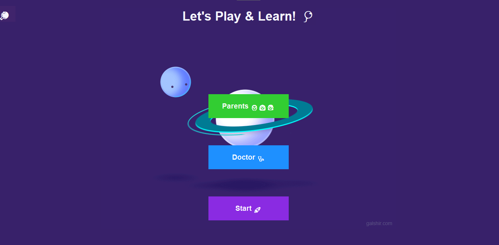
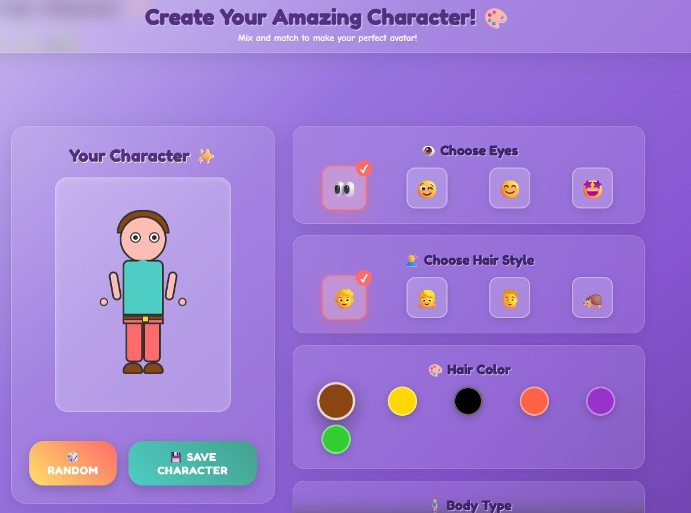
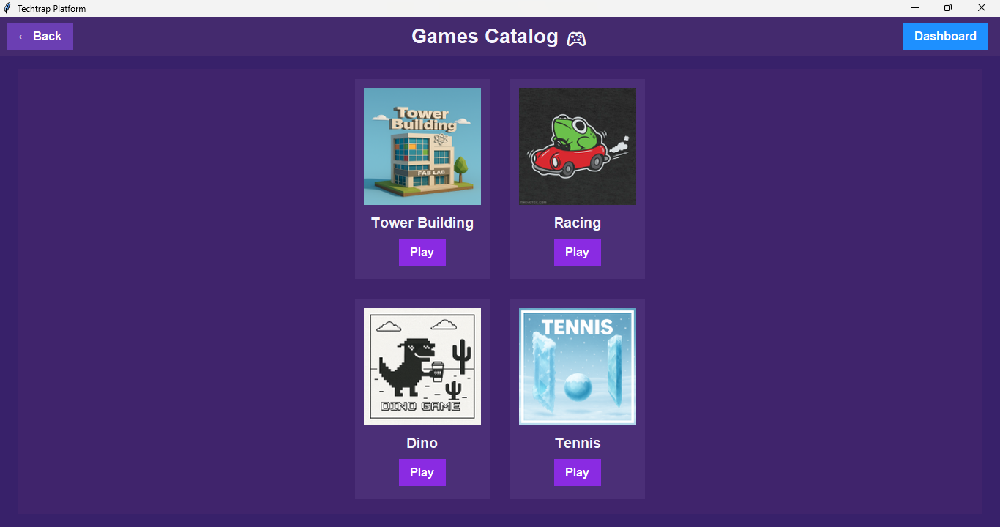
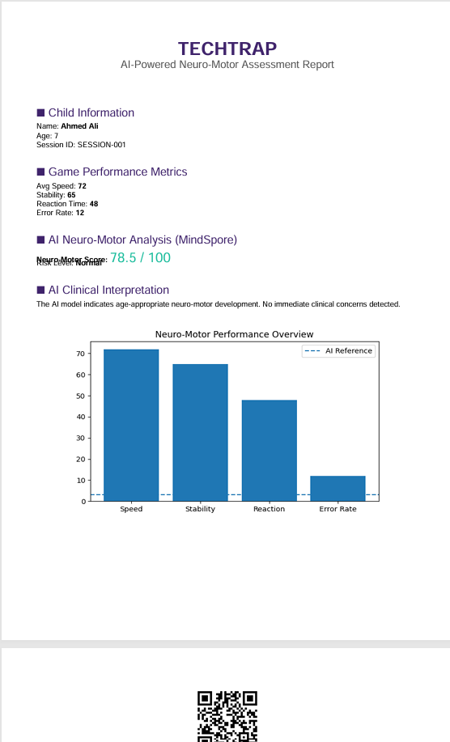
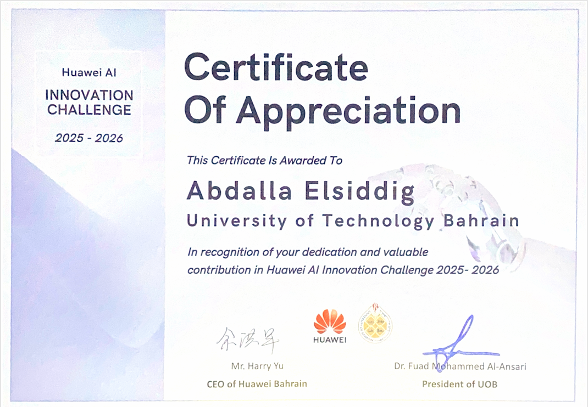
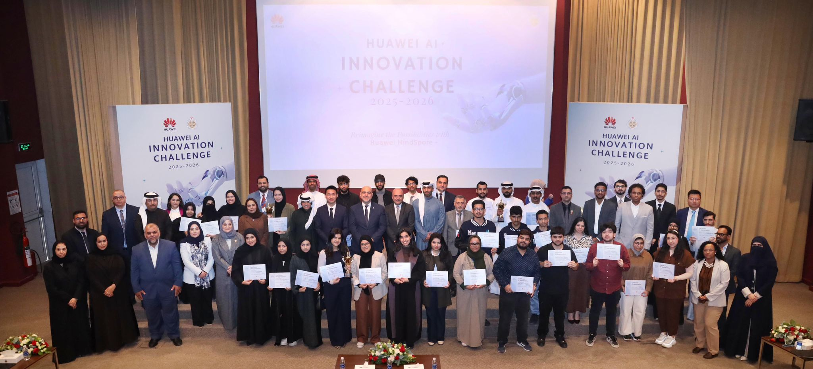
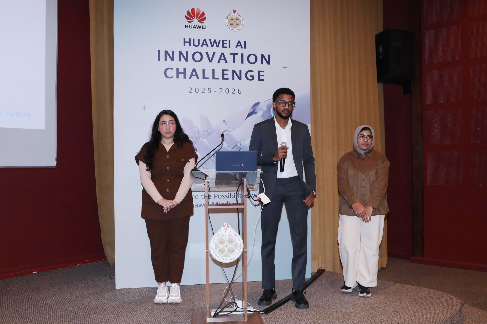
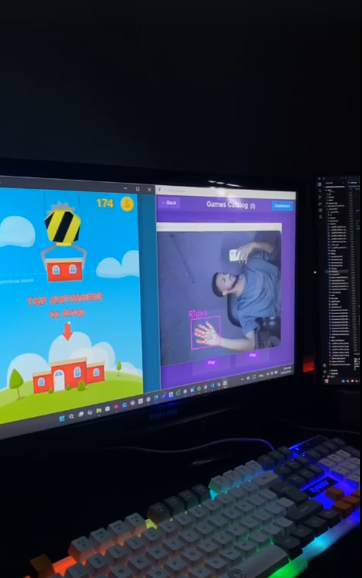
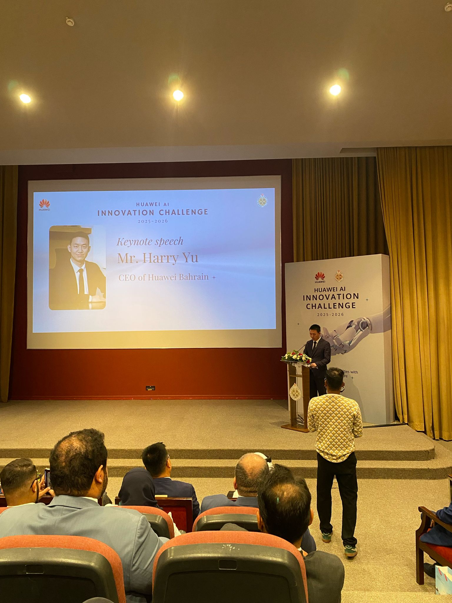
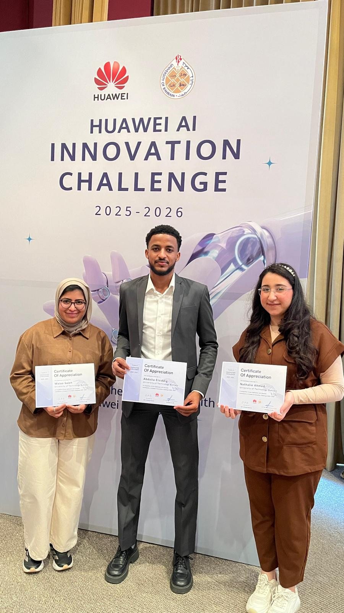

<div align="center">

# TECHTRAP

### AI-Powered Neuro-Motor Assessment Through Adaptive Gaming

[](https://python.org)
[](https://mindspore.cn)
[](https://opencv.org)
[](https://mediapipe.dev)
[](LICENSE)
[](https://e.huawei.com/en/talent/ict/)

</div>

---

## Overview

**TECHTRAP** is an AI-driven therapeutic gaming platform designed to assess neuro-motor development in children aged 4–12 through real-time hand gesture and body motion analysis. Using a standard webcam and Huawei's **MindSpore** neural network framework, the platform transforms gameplay into a clinically meaningful motor assessment — producing instant AI-powered doctor reports without specialized medical equipment.

Built as part of the **Huawei ICT Innovation Competition 2024**, TECHTRAP bridges the gap between entertainment and healthcare by making neuro-motor screening accessible, engaging, and affordable for schools, clinics, and families.

---

## The Problem

> **Millions of children worldwide have undiagnosed motor development delays.**

Early detection of neuro-motor conditions — such as developmental coordination disorder (DCD), fine motor delay, and proprioceptive impairments — is critical for effective intervention. However:

- Clinical motor assessments require specialized therapists and expensive equipment
- Children often resist formal medical evaluations
- Rural and underserved communities have minimal access to pediatric occupational therapy
- Traditional screening tools are time-consuming and require trained professionals

**Result:** Most delays go undetected until they significantly impact a child's academic performance and social development.

---

## Our Solution

TECHTRAP turns a 10-minute play session into a structured neuro-motor screening.

Children play **hand-gesture-controlled games** — racing, tower building, dino jump, and tennis — while the platform silently captures movement data: reaction times, hand stability, gesture precision, and error patterns.

A **MindSpore neural network** then analyzes these metrics against a trained model of age-appropriate motor baselines, producing a **Doctor Report** with:
- Neuro-Motor Score (0–100)
- Risk Level classification (Normal / Mild Delay / Needs Attention)
- AI clinical interpretation
- Visual performance chart
- QR code for digital session traceability

---

## Key Features

| Feature | Description |
|---------|-------------|
| **Real-Time Hand Tracking** | MediaPipe + cvzone hand detection at 30 FPS |
| **4 Therapeutic Games** | Each game targets different motor skill domains |
| **MindSpore AI Analysis** | On-device neural network assessment |
| **Instant Doctor Reports** | Auto-generated PDF with charts and clinical interpretation |
| **Parent & Doctor Portals** | Role-based access with login authentication |
| **Custom Character Creator** | Built-in avatar designer + HTML character tool |
| **Smart Dashboard** | Session history, game logs, performance trends |
| **ART Mode** | Free-hand drawing game for fine motor assessment |
| **Fully Offline** | No internet required for core functionality |

---

## Technology Stack

```
Frontend (GUI)      : Python Tkinter, Pillow
Computer Vision     : OpenCV, MediaPipe, cvzone
AI / Neural Network : Huawei MindSpore 2.2
Report Generation   : ReportLab, Matplotlib, qrcode
Audio               : pygame
Windows Integration : ctypes (SendInput API)
Data Storage        : JSON (session persistence)
```

---

## System Architecture

```
TECHTRAP/
│
├── main.py                    # Entry point — game orchestrator
│
├── src/
│   ├── gui/
│   │   └── gui.py             # Full Tkinter UI (welcome, character, catalog, dashboard)
│   ├── ai/
│   │   └── mindspore_analysis.py   # NeuroMotorNet — MindSpore neural network
│   ├── reports/
│   │   └── doctor_report.py   # PDF report generation (ReportLab + matplotlib)
│   ├── utils/
│   │   └── game_metrics.py    # Metric collection & visualization
│   └── games/
│       ├── directkeys1.py     # Windows key simulation: ENTER (Game 1)
│       ├── directkeys2.py     # Windows key simulation: LEFT/RIGHT (Game 2)
│       └── directkeys3.py     # Windows key simulation: SPACE (Game 3)
│
├── assets/
│   ├── images/                # Game thumbnails, UI graphics, GIFs
│   ├── sounds/                # Background music
│   ├── icons/                 # ART game color header overlays
│   └── sprites/               # Game sprite assets
│
├── docs/
│   ├── architecture/          # System diagrams
│   ├── screenshots/           # Application screenshots
│   ├── certificates/          # Competition certificates
│   └── competition_day/       # Event photos
│
├── outputs/
│   ├── reports/               # Generated PDF doctor reports
│   └── analytics/             # Session analytics
│
├── models/                    # Trained MindSpore model weights
├── data.json                  # Session persistence
└── character.html             # Web-based character designer
```

---

## AI Pipeline

```
Gameplay Session
       |
       v
 ┌─────────────────────────────┐
 │   Game Metrics Collector    │
 │  ┌──────────────────────┐   │
 │  │ Reaction Times       │   │
 │  │ Hand Position Stream │   │
 │  │ Gesture Errors       │   │
 │  │ Session Duration     │   │
 │  └──────────────────────┘   │
 └─────────────┬───────────────┘
               |
               v
 ┌─────────────────────────────┐
 │   Feature Extraction        │
 │  avg_reaction_time          │
 │  movement_stability         │
 │  error_count                │
 │  session_duration           │
 └─────────────┬───────────────┘
               |
               v
 ┌─────────────────────────────┐
 │  MindSpore NeuroMotorNet    │
 │  Input  : 4 features        │
 │  Layer 1: Dense(4  → 16)   │
 │  Layer 2: Dense(16 → 8)    │
 │  Layer 3: Dense(8  → 1)    │
 │  Output : Score ∈ [0, 1]   │
 └─────────────┬───────────────┘
               |
               v
 ┌─────────────────────────────┐
 │   Risk Classification       │
 │  ≥ 80% → Normal            │
 │  55–79% → Mild Delay       │
 │  < 55%  → Needs Attention  │
 └─────────────┬───────────────┘
               |
               v
        Doctor Report PDF
```

---

## How It Works

1. **Child selects a character** — built-in avatar or custom design via the HTML creator
2. **Games page opens** — 4 hand-gesture games across 2 catalog pages
3. **Child plays** — webcam captures hand movements in real time
4. **Metrics are collected silently** — reaction times, position streams, error rates
5. **AI analyzes** — MindSpore NeuroMotorNet produces a neuro-motor score
6. **Doctor report is generated** — PDF with charts, QR code, and clinical interpretation
7. **Dashboard is updated** — session is logged for the parent and doctor portals

---

## Application Screenshots

> **Note:** Add screenshots to `docs/screenshots/` to display them here.

| Screen | Preview |
|--------|---------|
| Welcome Page |  |
| Character Creator |  |
| Games Catalog |  |
| ART Game |  |
| Doctor Report |  |

---

## Huawei ICT Competition

### About the Competition

**Huawei ICT Competition** is a global technology contest organized by Huawei Technologies, targeting university students across more than 80 countries. The competition challenges teams to build innovative, real-world solutions using cutting-edge Huawei technologies.

### TECHTRAP in the Competition

| Field | Detail |
|-------|--------|
| **Track** | Innovation — AI & Healthcare |
| **Technology** | Huawei MindSpore AI Framework |
| **Problem Domain** | Pediatric Neuro-Motor Health |
| **Target Users** | Children (4–12), Parents, Healthcare Professionals |
| **Deployment** | Offline-first, edge-device compatible |

### What We Demonstrated

- **Live Gameplay Demo:** Judges interacted with the platform in real time, playing gesture-controlled games
- **AI Inference:** The MindSpore model ran entirely on-device, with zero cloud dependency
- **Doctor Report Generation:** End-to-end flow from gameplay to clinical PDF in under 60 seconds
- **Accessibility Argument:** The platform requires only a standard $20 webcam — making it viable for schools and clinics in developing regions

### Technical Highlights for Judges

> TECHTRAP demonstrates that healthcare AI does not require hospital-grade hardware. By combining real-time computer vision with on-device MindSpore inference, we deliver a clinically meaningful motor screening experience in the form of a game — lowering barriers, improving engagement, and enabling early detection at scale.

---

## Certificates & Achievements

> Add certificate images to `docs/certificates/` and they will appear here automatically.




---

## Competition Day Gallery

> Add photos to `docs/competition_day/` and they will display here.

| | |
|--|--|
|  | **Team Presentation** — Live demonstration of TECHTRAP to the competition panel. |
|  | **Project Demonstration** — End-to-end showcase of the AI pipeline in action. |
|  | **Judging Session** — Q&A with industry experts and Huawei technical evaluators. |
|  | **Team Photo** — The TECHTRAP team after the competition. |

---

## Installation Guide

### Prerequisites

- Python 3.9 or higher
- Webcam (built-in or USB)
- Windows 10/11 (required for keyboard simulation via ctypes)
- MindSpore compatible environment

### Setup

```bash
# 1. Clone the repository
git clone https://github.com/your-username/TECHTRAP.git
cd TECHTRAP

# 2. Create virtual environment
python -m venv .venv
.venv\Scripts\activate     # Windows

# 3. Install dependencies
pip install -r requirements.txt

# 4. Run the application
python main.py
```

### MindSpore Installation

MindSpore may require a specific install command depending on your hardware:

```bash
# CPU (Windows)
pip install mindspore==2.2.0

# For GPU support, see: https://mindspore.cn/install
```

---

## Usage Guide

| Step | Action |
|------|--------|
| 1 | Run `python main.py` from the project root |
| 2 | Click **Start** on the Welcome screen |
| 3 | Create your child's profile on the Character screen |
| 4 | Click **Save** then **Let's Play** |
| 5 | Select a game from the catalog |
| 6 | Play using hand gestures in front of the webcam |
| 7 | Press `Q` to end a session |
| 8 | Doctor report is auto-generated as a PDF |

### Login Credentials (default)

| Role | Username | Password |
|------|----------|----------|
| Parent | `parent` | `1234` |
| Doctor | `doctor` | `1234` |

---

## Game Descriptions

| Game | Motor Skills Assessed | Controls |
|------|----------------------|----------|
| **Tower Building** | Fine motor precision, sustained gesture | Closed fist = press ENTER |
| **Racing** | Reaction time, motor switching | Open hand = GAS, Fist = BRAKE |
| **Dino Jump** | Timing, impulse control | Closed fist = SPACE |
| **Tennis / Pong** | Bilateral coordination, tracking | Two-hand tracking |
| **ART** | Fine motor, drawing precision | Index finger = draw, Two fingers = color select |

---

## Repository Structure

```
TECHTRAP/
├── main.py                    # Application entry point
├── character.html             # HTML-based character designer
├── data.json                  # Session data (auto-created)
├── selected_character.json    # Saved character path
├── requirements.txt           # Python dependencies
├── .gitignore                 # Git ignore rules
├── LICENSE                    # MIT License
│
├── src/                       # All Python source modules
│   ├── ai/                    # MindSpore AI model
│   ├── games/                 # Game controllers + demo scripts
│   ├── gui/                   # Tkinter user interface
│   ├── reports/               # PDF report generation
│   └── utils/                 # Metrics collection + utilities
│
├── assets/                    # Static assets
│   ├── images/                # Game UI images, GIFs
│   ├── icons/                 # ART game color overlays
│   ├── sounds/                # Background music
│   └── sprites/               # Game sprites
│
├── docs/                      # Documentation & media
│   ├── architecture/          # System architecture diagrams
│   ├── certificates/          # Competition certificates
│   ├── competition_day/       # Event photos
│   └── screenshots/           # App screenshots
│
├── outputs/                   # Runtime-generated files
│   ├── reports/               # PDF doctor reports
│   └── analytics/             # Session analytics
│
└── models/                    # Trained model weights
```

---

## Future Improvements

- [ ] **Trained Model Weights** — Replace the current random-init inference with a model trained on labeled pediatric motor datasets
- [ ] **Cloud Sync** — Optional session upload for longitudinal tracking by therapists
- [ ] **Cross-Platform** — Linux/macOS support (currently Windows-only due to ctypes keyboard simulation)
- [ ] **More Games** — BodyTrack (full body pose), Virtual Mouse (cursor control), and more
- [ ] **Pose-Based Assessment** — MediaPipe Pose for whole-body motor evaluation
- [ ] **Multilingual UI** — Arabic, French, and Spanish localization
- [ ] **Therapist Dashboard** — Web-based portal for healthcare providers to track multiple patients
- [ ] **PDF Report Archive** — Structured `outputs/reports/` folder with automatic naming and indexing

---

## Team Members

> Update with your team information.

| Name | Role |
|------|------|
| Abdalla Elsiddig | Lead Developer, AI Integration, Computer Vision Pipeline |
| Wala Saleh | UI/UX Design |
| Nathalie AHMED| Project Presenter & Team Representative |

---

## Acknowledgements

- **Huawei Technologies** — for MindSpore and the ICT Competition platform
- **University of Technology Bahrain (UTB)** — for institutional support
- **Google MediaPipe** — for real-time hand and pose detection
- **cvzone** — for the simplified computer vision interface
- **ReportLab** — for PDF generation

---

## License

This project is licensed under the MIT License — see the [LICENSE](LICENSE) file for details.

---

<div align="center">

**TECHTRAP** — *Transforming Play into Clinical Insight*

Made with passion for children's health and AI innovation.

</div>
